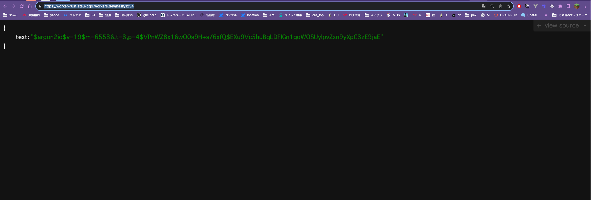

# password-hasher-rust
`rust`で`argon2`を使って`password`を`hash`化します。

## 利用方法
`cloudflare worker`で動いているので、以下のどっちかでアクセスしてください。

### ブラウザから
以下のURLにアクセスしてください(`<fill>`をハッシュ化したいパスワードにしてください)。
- `https://password-hasher-rust.atabata.site/hash/<fill>`

こちらを開くと以下のような画面になるので`text`が`hash`化されたパスワードです。



### コマンドラインから
`curl`とかで適用にアクセスしてください。

```shell
## hash化したいパスワード
PASSWORD=""

## curlする
curl "https://password-hasher-rust.atabata.site/hash/${PASSWORD}" | jq .text -r
```